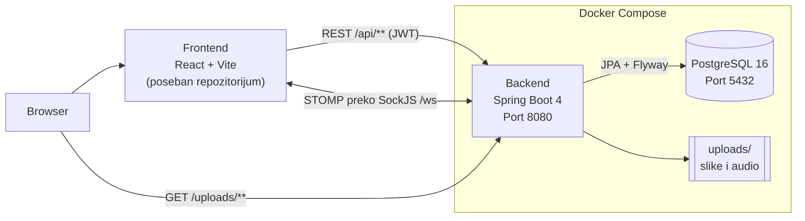

# Kahoot Frontend

Frontend za Kahoot-like aplikaciju za kvizove uživo. Registrovani korisnici prave kvizove (tekst, slike, audio) i pokreću partije sa PIN kodom. Igrači ulaze bez naloga i odgovaraju u realnom vremenu preko WebSocket-a, a poeni zavise od brzine i niza tačnih odgovora.

Ovo je **frontend deo** aplikacije: React 19 + Vite, sa real-time komunikacijom preko STOMP-a (WebSocket + SockJS). Backend (Spring Boot + PostgreSQL) je poseban repozitorijum: [kahoot-backend](https://github.com/Dumanex/kahoot-backend).

## Funkcionalnosti

**Host (registrovan korisnik)**
- **Registracija i prijava**: nalog se pravi sa korisničkim imenom, email-om i lozinkom
- **Dashboard**: spisak mojih kvizova, partije koje su u toku (sa dugmetom *Nastavi*) i istorija završenih partija sa pobednikom
- **Editor kviza**: naslov, opis i podrazumevano vreme po pitanju. Pitanja se dodaju, menjaju i brišu
- **Četiri tipa pitanja**: višestruki izbor, tačno/netačno, prepoznavanje slike i audio pitanje, svako sa 2-4 odgovora i jednim tačnim
- **Upload medija**: slika ili audio se otprema direktno iz editora. Kod audio pitanja se vreme za odgovor automatski postavlja na trajanje snimka
- **Pokretanje partije**: host bira da li je partija javna ili privatna i dobija 6-cifreni PIN koji prikazuje igračima
- **Vođenje igre**: host vidi ko je ušao, pokreće igru, prati koliko igrača je odgovorilo, vidi statistiku odgovora posle svakog pitanja i prelazi na sledeće pitanje ili završava igru ranije
- **Povratak u partiju**: posle osvežavanja stranice ili zatvaranja taba host se vraća u partiju sa Dashboard-a

**Igrač (bez naloga)**
- **Ulazak u partiju**: sa PIN-om i nadimkom, ili izborom iz liste javnih partija sa pretragom po nazivu kviza, hostu ili PIN-u
- **Igra u realnom vremenu**: čekaonica sa spiskom igrača, pa za svako pitanje kratko „Spremi se”, zatim odgovaranje uz tajmer
- **Tajmer prema serverskom vremenu**: svi igrači vide isto preostalo vreme, bez obzira na sat na svom uređaju
- **Izmešani odgovori**: svaki igrač vidi odgovore drugačijim redom, a svaki odgovor zadržava svoju boju i simbol (kao u Kahoot-u)
- **Rezultat posle pitanja**: igrač vidi da li je odgovorio tačno tek kada se pitanje zatvori
- **Povratak posle osvežavanja stranice**: igrač nastavlja istu partiju sa istim poenima, bez ponovnog unosa nadimka
- **Kraj igre**: podijum sa prva tri mesta i kompletna rang-lista

## Arhitektura

### Infrastruktura



Frontend je *single-page* aplikacija. Posle build-a to su samo statički fajlovi (HTML, JS, CSS) koje browser preuzme jednom, a sve ostalo se dešava u browseru:
- **REST** (Axios) za nalog, kvizove, upload, pravljenje partije i ulazak u nju, i za učitavanje trenutnog stanja partije posle osvežavanja stranice.
- **WebSocket (STOMP preko SockJS)** za samu igru: frontend prima pitanja, broj odgovora, rezultate i rang-listu, a igrač šalje odgovore.
- **Slike i audio** browser učitava direktno sa backenda (`/uploads/...`), preko URL-a koji backend vrati posle upload-a.

Stanje aplikacije čuvaju dva **Zustand** store-a: `authStore` (prijavljeni korisnik i JWT) i `gameStore` (stanje partije koja je u toku). Frontend ne čuva poene i ne računa tačnost odgovora, jer sve to radi server.

## Tehnologije

| Tehnologija | Verzija | Namena |
|---|---|---|
| React | 19.2.8 | Korisnički interfejs |
| React Router | 7.18.3 | Rutiranje i zaštićene stranice |
| Vite | 8.2.0 | Dev server i build |
| @vitejs/plugin-react | 6.0.5 | React podrška u Vite-u |
| Tailwind CSS | 4.3.3 (`@tailwindcss/vite`) | Stilovi |
| Zustand | 5.0.15 | Globalno stanje (nalog i partija), čuvanje prijave u `localStorage` |
| Axios | 1.20.0 | REST pozivi, automatsko dodavanje JWT tokena |
| @stomp/stompjs | 7.3.0 | STOMP klijent za igru u realnom vremenu |
| sockjs-client | 1.6.1 | WebSocket transport (isti SockJS endpoint `/ws` kao na backendu) |
| lucide-react | 1.47.0 | Ikonice |
| ESLint | 10.8.0 | Provera koda |

## Struktura projekta

```
kahoot-frontend/
├── public/                 # favicon i ikonice
├── src/
│   ├── api/                # axios.js (URL backenda, JWT interceptor), authApi, quizApi, gameApi
│   ├── components/
│   │   ├── common/         # PinInput, Timer
│   │   ├── game/           # QuestionDisplay, AnswerOptions, QuestionStats, Podium, Leaderboard, PublicGamesList, HostGames (partije u toku i istorija)
│   │   ├── layout/         # PageShell (zajednički okvir stranice)
│   │   ├── quiz/           # QuizCard, QuestionEditor, AnswerEditor
│   │   └── ui/             # Button, Card, Input, Textarea, Badge, Modal, Spinner
│   ├── hooks/              # useGameConnection (STOMP konekcija i sinhronizacija stanja), useQuestionPhase (faze pitanja: spremi se → odgovaranje → rezultati)
│   ├── pages/              # Jedna komponenta po ruti (Home, Login, Dashboard, QuizEditor, HostGame, ...)
│   ├── stores/             # authStore, gameStore (Zustand)
│   ├── utils/              # prevod poruka o greškama, čuvanje igrača u storage-u, rang, mešanje odgovora
│   ├── App.jsx             # Rute
│   ├── main.jsx            # Ulazna tačka
│   └── index.css           # Tailwind i boje teme
├── index.html
├── vite.config.js
├── eslint.config.js
├── .env.example            # Šablon za environment varijable
└── DEPLOYMENT.md           # Uputstvo za produkciju
```

## Preduslovi

- [Node.js](https://nodejs.org/) **20.19+** ili **22.12+** (to traži Vite 8), sa npm-om. Provereno sa Node.js 24.18.1 i npm 12.0.2
- Git
- Pokrenut [backend](https://github.com/Dumanex/kahoot-backend) na `http://localhost:8080`

## Lokalno pokretanje

### 1. Kloniranje repozitorijuma

```bash
git clone https://github.com/Dumanex/kahoot-frontend.git
cd kahoot-frontend
```

### 2. Instalacija zavisnosti

```bash
npm ci
```

`npm ci` instalira tačne verzije iz `package-lock.json`.

### 3. Environment varijable

```bash
cp .env.example .env
```

Šablon već pokazuje na lokalni backend (`http://localhost:8080`), pa za lokalni razvoj ništa ne treba menjati. Ovaj korak se može i preskočiti, jer se bez `.env` fajla koristi ista podrazumevana adresa. Opis je u sekciji [Environment varijable](#environment-varijable).

### 4. Pokretanje backenda

> **Frontend ne radi bez backenda.** Backend mora biti pokrenut pre korišćenja aplikacije.

Pokrenuti bazu i backend po uputstvu iz [backend README-a](https://github.com/Dumanex/kahoot-backend#lokalno-pokretanje). Backend treba da odgovara na http://localhost:8080 (npr. Swagger UI na http://localhost:8080/swagger-ui.html).

Adresa `http://localhost:5173` je već u podrazumevanom `CORS_ALLOWED_ORIGINS` backenda, pa CORS ne treba dodatno podešavati.

### 5. Pokretanje frontenda

```bash
npm run dev
```

Aplikacija radi na **http://localhost:5173**. Izmene u kodu se odmah vide u browseru.

### 6. Provera

1. Otvoriti http://localhost:5173 i registrovati se.
2. Na Dashboard-u napraviti kviz sa bar jednim pitanjem, pa kliknuti *Host*.
3. U drugom browseru ili privatnom prozoru otvoriti http://localhost:5173, kliknuti *Pridruži se preko PIN koda* i uneti PIN sa ekrana hosta.
4. Kada se igrač pojavi kod hosta, pokrenuti igru.

### Ostale komande

| Komanda | Opis |
|---|---|
| `npm run build` | Produkcioni build u folder `dist/` |
| `npm run preview` | Lokalno serviranje build-a iz `dist/` na http://localhost:4173 |
| `npm run lint` | ESLint provera koda |

## Environment varijable

| Naziv | Opis | Podrazumevano | Primer |
|---|---|---|---|
| `VITE_API_URL` | Osnovni URL backenda, bez `/` na kraju. Frontend na njega dodaje `/api` za REST i `/ws` za WebSocket | `http://localhost:8080` | `https://api.kviz.example.com` |

Vite čita varijable iz `.env` fajla **pri pokretanju `npm run dev` i pri build-u**, i ugrađuje ih u JavaScript koji dobija browser. Zato:
- posle izmene `.env` treba ponovo pokrenuti `npm run dev`, odnosno ponovo uraditi build
- u ove varijable se nikad ne upisuju tajne (lozinke, ključevi), jer ih svako može pročitati u browseru

Šablon je u `.env.example`. Fajl `.env` je u `.gitignore` i ne commit-uje se.

## Stranice aplikacije

| Ruta | Pristup | Opis |
|---|---|---|
| `/` | svi | Početna: prijava/registracija, ulazak preko PIN-a i lista javnih partija sa pretragom |
| `/login` | samo neprijavljeni | Prijava |
| `/register` | samo neprijavljeni | Registracija |
| `/dashboard` | prijavljeni | Moji kvizovi, partije u toku i istorija partija |
| `/quiz/new` | prijavljeni | Novi kviz |
| `/quiz/:id/edit` | prijavljeni (autor kviza) | Izmena kviza i njegovih pitanja |
| `/host/:pin` | prijavljeni (host partije) | Ekran hosta: PIN i igrači, pitanja, statistika, podijum |
| `/join` | svi | Ulazak u partiju (PIN + nadimak) |
| `/play/:pin` | igrač te partije | Ekran igrača: čekaonica, pitanje, rezultat, podijum |
| `/results/:pin` | svi | Konačna rang-lista završene partije |
| bilo koja druga | svi | Stranica 404 |

Neprijavljen korisnik koji otvori zaštićenu stranicu biva preusmeren na `/login`, a prijavljen korisnik sa `/login` i `/register` ide na `/dashboard`.

## Komunikacija sa backendom

### URL backenda

Adresa backenda se podešava na jednom mestu, u `src/api/axios.js`:

```js
export const API_URL = import.meta.env.VITE_API_URL || "http://localhost:8080";
```

- REST pozivi idu na `${API_URL}/api` (Axios instanca iz istog fajla, koju koriste `authApi.js`, `quizApi.js` i `gameApi.js`)
- WebSocket konekcija ide na `${API_URL}/ws` (`src/hooks/useGameConnection.js`)

### Autentikacija na klijentu

**Host (JWT)**
- Posle prijave ili registracije backend vrati JWT, a frontend ga čuva u `authStore`.
- Zustand `persist` čuva store u `localStorage` pod ključem `auth-storage` (korisnik, token, `isAuthenticated`), pa prijava ostaje i posle osvežavanja stranice ili zatvaranja browsera.
- Axios interceptor svakom REST zahtevu dodaje header `Authorization: Bearer <token>`.
- Ako backend vrati `401` (npr. token je istekao, podrazumevano posle 24 h), frontend odjavljuje korisnika.
- Za WebSocket host šalje isti token u STOMP `CONNECT` frame-u. Ako ga server odbije, host se takođe odjavljuje.
- *Odjavi se* briše token iz store-a i iz `localStorage`-a.

**Igrač (bez naloga)**
- Posle ulaska u partiju backend vrati `id` igrača i `rejoinToken`.
- Frontend ih čuva pod ključem `player-<PIN>` u `sessionStorage` (za povratak u istom tabu posle osvežavanja) i u `localStorage` (da bi na ekranu za ulazak ponudio *Nastavi* kao isti igrač).
- Igrač šalje `playerId` i `rejoinToken` u STOMP `CONNECT` frame-u i u svakom odgovoru.

### Tok konekcije u igri

Na ekranu hosta i igrača `useGameConnection` otvara STOMP konekciju (sa automatskim ponovnim povezivanjem na 5 s) i posle svakog uspešnog povezivanja:
1. se pretplaćuje na poruke partije (`/topic/game/{pin}/...`) i na privatne poruke (`/user/queue/...`)
2. učitava trenutno stanje partije preko `GET /api/games/{pin}/state`
3. ako je u pitanju igrač, potvrđuje identitet preko `POST /api/games/{pin}/rejoin`

Zbog ovoga se ekran uvek poklapa sa stanjem na serveru, i posle osvežavanja stranice ili prekida mreže.

### Korišćeni endpointi

| Vrsta | Endpointi |
|---|---|
| REST: nalog | `POST /api/auth/register`, `POST /api/auth/login` |
| REST: kvizovi i pitanja | `GET/POST /api/quizzes`, `GET/PUT/DELETE /api/quizzes/{id}`, `POST /api/quizzes/{quizId}/questions`, `PUT/DELETE /api/questions/{id}` |
| REST: upload | `POST /api/upload?type=image\|audio` |
| REST: partije | `POST /api/games/host`, `POST /api/games/{pin}/start`, `/next`, `/end`, `GET /api/games/mine`, `GET /api/games/public`, `POST /api/games/{pin}/join`, `/rejoin`, `GET /api/games/{pin}/state` |
| STOMP: slanje | `/app/game/{pin}/answer` (igrač), `/app/game/{pin}/finalize` (host) |
| STOMP: prijem | `/topic/game/{pin}/players`, `/started`, `/question`, `/answered`, `/round-results`, `/leaderboard`, `/ended`, `/user/queue/answer-accepted`, `/user/queue/answer-result`, `/user/queue/errors` |

Kompletan opis API-ja (tela zahteva i odgovora, greške) je u [backend README-u](https://github.com/Dumanex/kahoot-backend#pregled-api-ja) i u Swagger UI-ju backenda.

## Testovi

Frontend trenutno **nema automatizovane testove**. Backend ima 224 testa (vidi [backend README](https://github.com/Dumanex/kahoot-backend#testovi)).

Za proveru koda se koriste:

```bash
npm run lint    # ESLint
npm run build   # build prolazi samo ako nema grešaka u import-ima i sintaksi
```

## Produkcija

Postavljanje na server je opisano korak po korak u **[DEPLOYMENT.md](DEPLOYMENT.md)**.

## Backend

Spring Boot + PostgreSQL aplikacija: **https://github.com/Dumanex/kahoot-backend**

## Autor

**Vladimir Dumanovic** – [github.com/Dumanex](https://github.com/Dumanex)
